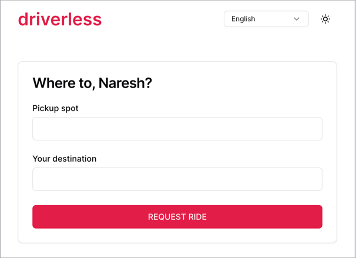
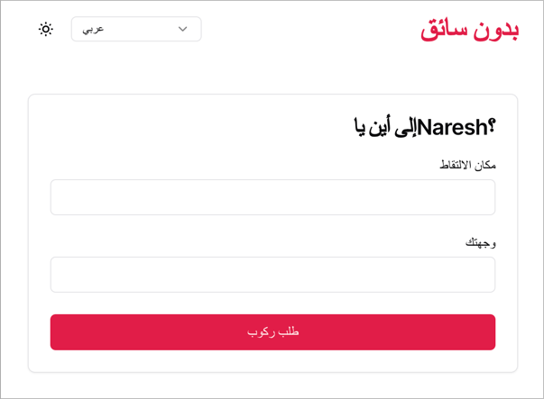
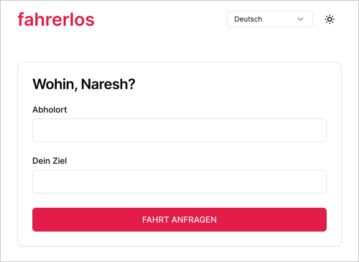
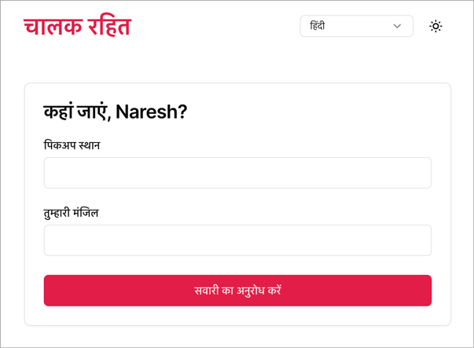
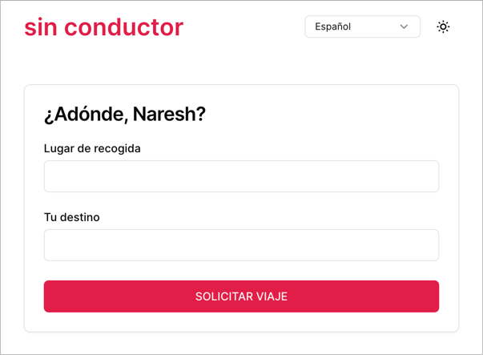

# i18n Demo

A sample app to demonstrate i18n & l10n concepts using some popular libraries.

### Live Demos

1. [FormatJS](https://i18n-demo-formatjs-demo.vercel.app/)
2. [i18next](https://i18n-demo-i18next-demo.vercel.app)

#### Screenshot - English



#### Screenshot - Arabic



#### Screenshot - German



#### Screenshot - Hindi



#### Screenshot - Italian


#### Screenshot - Spanish



## Prerequisites for development

1. [Node Version Manager](https://github.com/nvm-sh/nvm) (nvm) - allows using
   different versions of node via the command line

## Getting Started

```shell
nvm use        # use the required version of node
npm ci         # install dependencies
npm run dev    # run apps and storybook
```

Open browser windows at the following URLs to see the respective apps:

1. http://localhost:3000/: driverless using i18next
2. http://localhost:3001/: driverless using formatjs

## Production build

To build all packages and apps for production, run the following command:

```shell
npm ci
npm run build
```

## Clean build

Removes all build artifacts and performs a clean build.

```shell
npm run clean
npm ci
npm run dev
```
